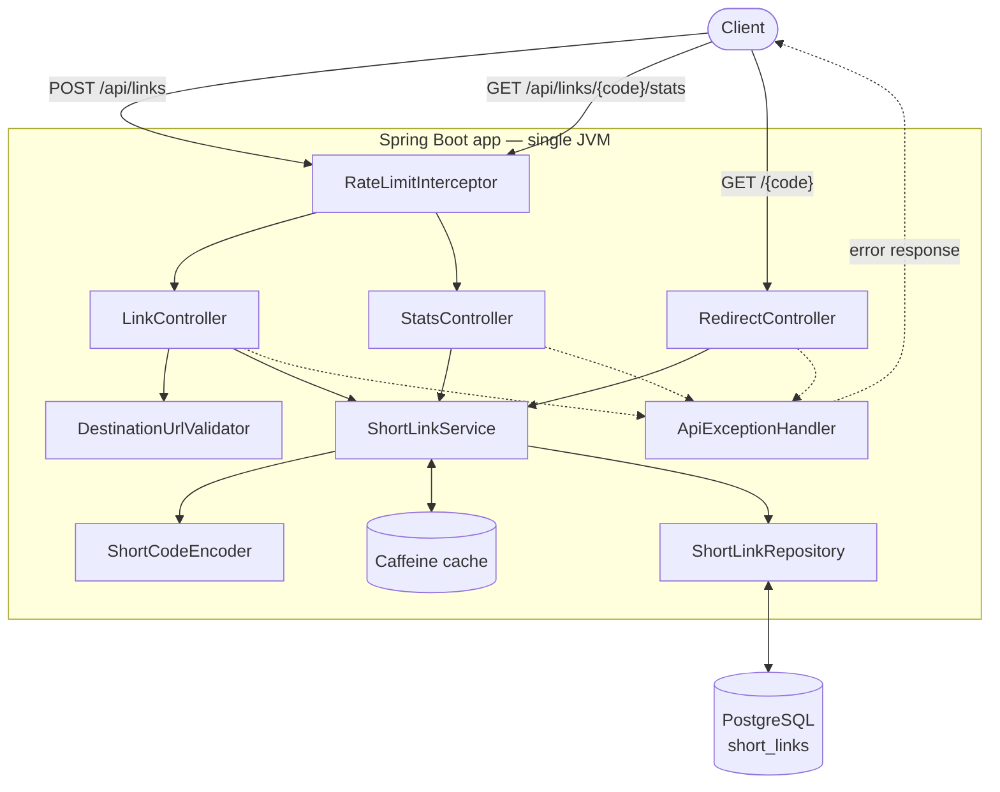
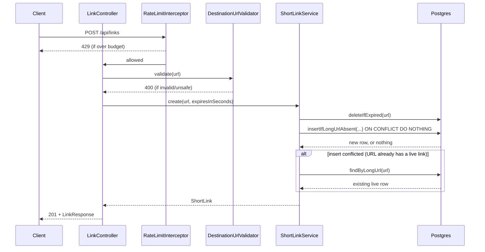
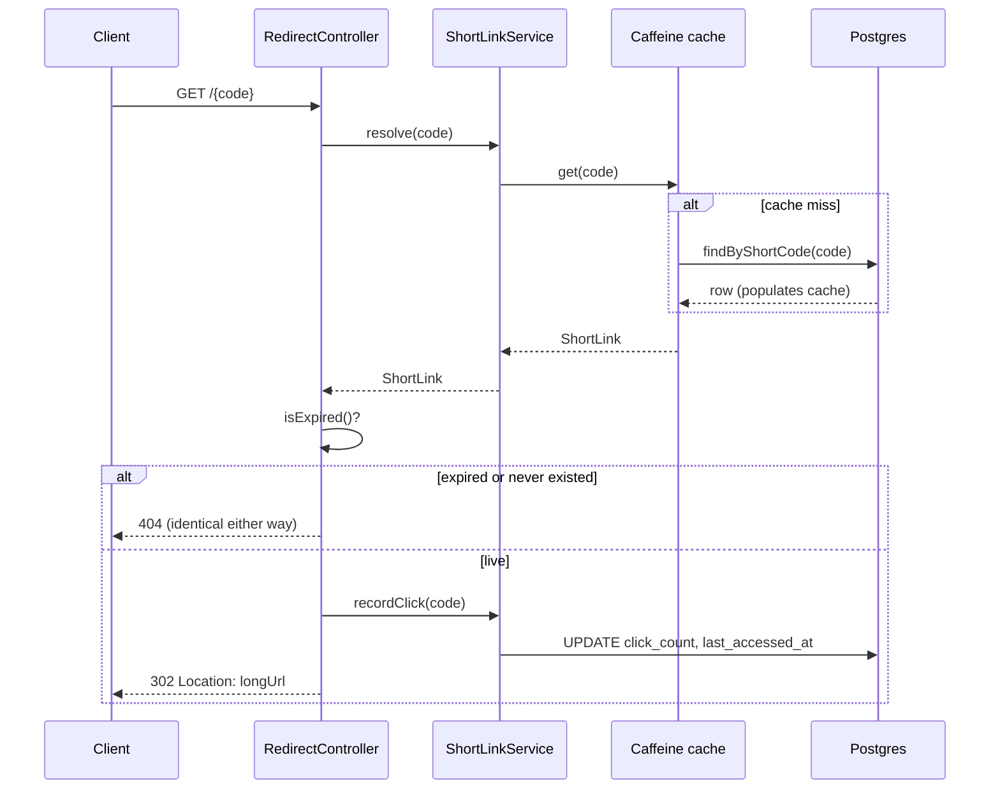
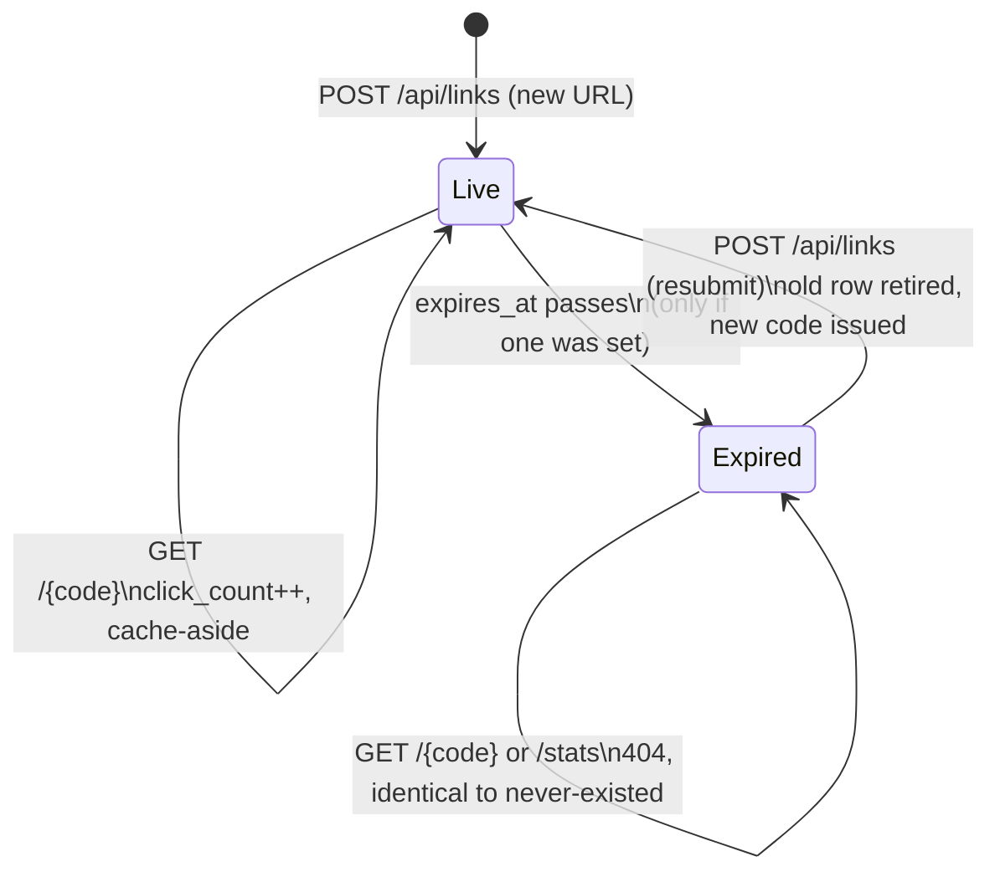

# Architecture Overview

## System at a glance

A single Spring Boot 3 (Java 21) service backed by one PostgreSQL database, run locally via Docker
Compose. Three request types matter: create a short link, redirect through one, and read its
stats. There's no queue, no separate analytics store, no second service — the whole system is one
JVM process and one database, deliberately, at the scale this project targets (see
`docs/design-decisions.md` for the reasoning behind every "why not X" in this document).

## Components

**HTTP layer** (one controller per capability, no shared "API" god-class):
- `LinkController` — `POST /api/links`
- `RedirectController` — `GET /{code}`
- `StatsController` — `GET /api/links/{code}/stats`
- `ApiExceptionHandler` — every domain exception (`InvalidUrlException`, `ShortLinkNotFoundException`, `RateLimitExceededException`, bean-validation failures) maps to the same `ErrorResponse` shape, in one place

**Domain logic**:
- `ShortLinkService` — the only thing that touches persistence; owns `create`, `resolve`, `recordClick`, `getStatsSnapshot`
- `ShortLink` — the JPA entity; also owns `isExpired()`, the single point of truth for expiry logic
- `ShortLinkRepository` — native SQL for the operations that need to be atomic (`insertIfLongUrlAbsent`, `deleteIfExpired`, `recordClick`) plus two derived-query lookups
- `ShortCodeEncoder` — sequence value → 6-character lowercase alphanumeric code
- `DestinationUrlValidator` — scheme allow-list + SSRF address-range rejection, no library

**Cross-cutting**:
- `CacheConfig` (Caffeine) — cache-aside in front of the redirect lookup
- `RateLimiter` / `RateLimitInterceptor` / `RateLimitConfig` / `WebConfig` — hand-rolled per-IP token bucket, applied to creation and stats
- `OpenApiConfig` — springdoc, serves `/swagger-ui.html` generated from the controllers' own annotations

**Data**: one table, `short_links` (schema in `docs/data-model.md`), migrated via Flyway
(`V1`–`V3`), persisted in PostgreSQL 16.

**Runtime**: `Dockerfile` (multi-stage Maven build → slim JRE image) + `docker-compose.yml`
(app + Postgres, health-checked, no manual setup).

## Tools and execution approach

Every feature was built as a conversation between the project owner and Claude Code, one git
branch per unit of work (`feature/{name}`), each scoped, decomposed, built, and validated in that
same conversation before being opened as its own PR.

**Per-feature execution pattern** (click analytics, link expiration, static analysis all followed
this): identify the ambiguity or gap → decompose it into concrete decision points → propose a
resolution with trade-offs, not just an answer → get explicit sign-off before touching
schema/persistence/security-relevant code → implement → validate against a real running system,
not just unit tests → document the decision and its rationale in `docs/scenarios/` or
`docs/design-decisions.md`, whichever the change actually was.

**Validation approach.** Contract/integration tests are written for every endpoint, but can't
execute via `mvn test` on this machine — a pre-existing Testcontainers/Docker Desktop
compatibility issue (documented in `design-decisions.md`'s Testing section), not something this
project's code caused. The substitute: `docker compose up --build` against the real app and a
real Postgres instance, exercised with `curl` for every scenario the automated tests also cover.
This wasn't just a formality — it's what actually caught a real concurrency bug in the link
expiration feature (a `WITH ... DELETE ... INSERT` statement that looked atomic and wasn't; see
`docs/scenarios/ambiguous-link-expiration.md`) that reasoning about the SQL alone had missed.

**Governance.** `.specify/memory/constitution.md` is treated as binding, not aspirational —
checked before and during implementation, not just at project start. principle I (Test-First) is the most important of all the principles and hence all work was done from a test first approach. This was done to make sure requirements are followed from the start.

## Control flow

### Create a short link

### Redirect

Note the click-count write happens *after* the cache lookup, unconditionally — it's not part of
the cached path, which is exactly why it still fires even on a cache hit (see "Click tracking" in
`design-decisions.md` for why that's a deliberate trade-off, not an oversight).

### Stats

Same shape as redirect (rate-limited, resolved via an *uncached* read so counts are never stale,
same expired-vs-never-existed 404 collapse) but returns the stats body instead of redirecting on
success. See `docs/api.yaml` for the exact contract.

### Short link lifecycle

A link with no `expiresInSeconds` never leaves the `Live` state. One row's identity (`short_code`)
never survives an `Expired → Live` transition — that transition deletes the old row and inserts a
new one, which is precisely the retire-and-reissue behavior from "Key decisions" below.

## Key decisions (summary — full rationale in `design-decisions.md`)

| Decision | Choice | Why (one line) |
|---|---|---|
| Short code generation | Sequence + base36 encoding | Collision-free by construction, no retry loop |
| Duplicate detection | `INSERT ... ON CONFLICT` | Atomic, lock-free, no app-level locking |
| Redirect caching | Caffeine, in-process | No second service to operate at this scale |
| Click counting | Synchronous, exact | Correctness over redirect-path purity, at this scale |
| Rate limiting | Hand-rolled token bucket | A few dozen lines; a library would be overkill |
| Link expiration enforcement | Read-time check, no sweep | No background-job infrastructure exists or is needed |
| Expired-link resubmission | New code, old one retired forever | Reactivation would defeat the point of expiry |
| Expired vs. never-existed | Same 404 | Consistent with never revealing *why* a code fails |
