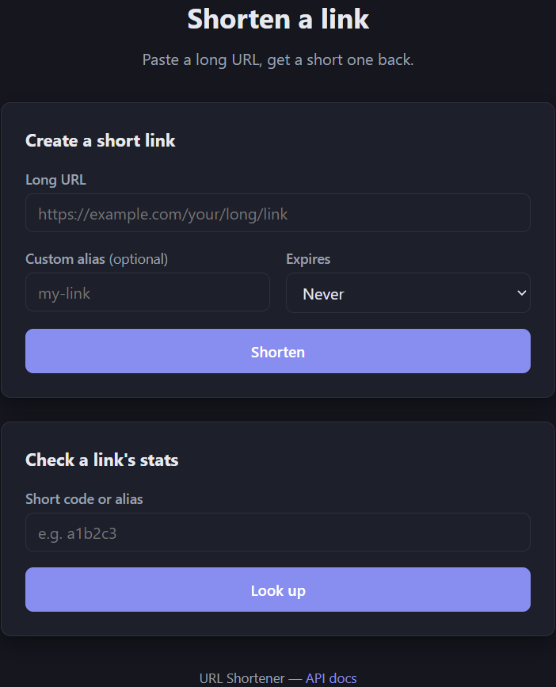

# Getting Started

## Prerequisites

- Docker and Docker Compose (the only requirement to run the full system end-to-end)
- For local development without full containerization: Java 21 and Maven — running the test
  suite does not require Docker (see "Run tests" below)

## Run the whole system

```bash
docker compose up --build
```

This builds the app image, starts PostgreSQL, waits for it to be healthy, runs the database
migrations automatically on startup, and starts the API. Once
`GET http://localhost:8080/actuator/health` returns `{"status":"UP"}`, the system is ready.

Swagger UI is available at `http://localhost:8080/swagger-ui.html` for interactive exploration.

## Try it

`http://localhost:8080/` serves a small page for shortening a link (with an optional expiration)
and looking up an existing code's stats — the easiest way to try the system, no `curl` required.
Nothing to install or build; it's served directly by the running app.



## Exercise the API directly

The scenarios below drive the same two endpoints the UI calls, but exactly — useful for
verifying precise behavior (status codes, error shapes, edge cases) rather than casual use.

> **Windows/PowerShell**: `curl` is aliased to `Invoke-WebRequest`, which doesn't support `-i`,
> `-X`, or `-d` the way real curl does, and the `\` line continuations below are a bash-ism.
> Use `curl.exe` explicitly and put each command on one line, e.g.
> `curl.exe -i -X POST http://localhost:8080/api/links -H "Content-Type: application/json" -d '{\"url\":\"https://example.com\"}'`
> (note double quotes inside `-d` need escaping as `\"` in PowerShell, unlike bash).

### Create a short link

```bash
curl -i -X POST http://localhost:8080/api/links \
  -H "Content-Type: application/json" \
  -d '{"url":"https://example.com/some/very/long/path?with=query"}'
```

Expect `201 Created`, a `Location` header with the short URL, and a JSON body with `shortCode`,
`shortUrl`, `longUrl`, and `createdAt` (see `api.yaml`).

### Follow the redirect

```bash
curl -i http://localhost:8080/<shortCode-from-previous-step>
```

Expect `302 Found` with a `Location` header equal to the original `longUrl`.

```bash
curl -i http://localhost:8080/zzzzzz
```

Expect `404 Not Found` with an error body (assuming `zzzzzz` was never created).

### Check click stats

```bash
curl -i http://localhost:8080/api/links/<shortCode-from-first-step>/stats
```

Expect `200 OK` with `clickCount` and `lastAccessedAt` reflecting how many times you followed the
redirect above. Before the first redirect, `clickCount` is `0` and `lastAccessedAt` is `null`.

```bash
curl -i http://localhost:8080/api/links/zzzzzz/stats
```

Expect `404 Not Found`, same as the redirect endpoint's response for an unknown code.

### Create a link that expires

```bash
curl -i -X POST http://localhost:8080/api/links \
  -H "Content-Type: application/json" \
  -d '{"url":"https://example.com/expires-soon","expiresInSeconds":2}'
```

Expect `201 Created` with `expiresAt` set (a couple of seconds from now). Follow the redirect
immediately — it works. Wait a few seconds and follow it again:

```bash
curl -i http://localhost:8080/<shortCode-from-above>
```

Expect `404 Not Found` — identical to a code that never existed. The stats endpoint for that same
code also now returns `404`.

Submit the *same* `url` again (without `expiresInSeconds` this time):

```bash
curl -i -X POST http://localhost:8080/api/links \
  -H "Content-Type: application/json" \
  -d '{"url":"https://example.com/expires-soon"}'
```

Expect `201 Created` with a **different** `shortCode` than the expired one — the old code stays
dead permanently; it is never reactivated.

### Submit a duplicate URL

Submit the exact same `url` from the first `curl` above a second time. Expect `201 Created`
again, but with the **same** `shortCode`/`shortUrl` as the first response — no second row is
created.

### Submit invalid or unsafe URLs

```bash
curl -i -X POST http://localhost:8080/api/links \
  -H "Content-Type: application/json" \
  -d '{"url":"not-a-url"}'

curl -i -X POST http://localhost:8080/api/links \
  -H "Content-Type: application/json" \
  -d '{"url":"javascript:alert(1)"}'

curl -i -X POST http://localhost:8080/api/links \
  -H "Content-Type: application/json" \
  -d '{"url":"http://127.0.0.1:8080/admin"}'
```

Expect all three to return `400 Bad Request` with an error body, and no short link created for
any of them.

### Trigger the rate limiter

Issue creation requests rapidly in a loop from the same source IP past the configured limit.
Expect `429 Too Many Requests` with a `Retry-After` header once the limit is exceeded, until the
window resets.

## Run tests

```bash
mvn test
```

Runs unit tests (no external dependencies) and integration/contract tests against a real Postgres
instance (Zonky's embedded-postgres starts an actual Postgres binary directly on the host,
automatically — no Docker, no manual database setup, no external dependency to install).
