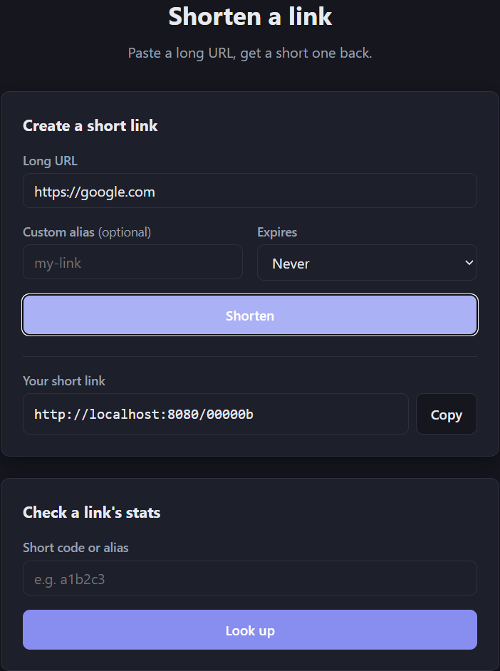
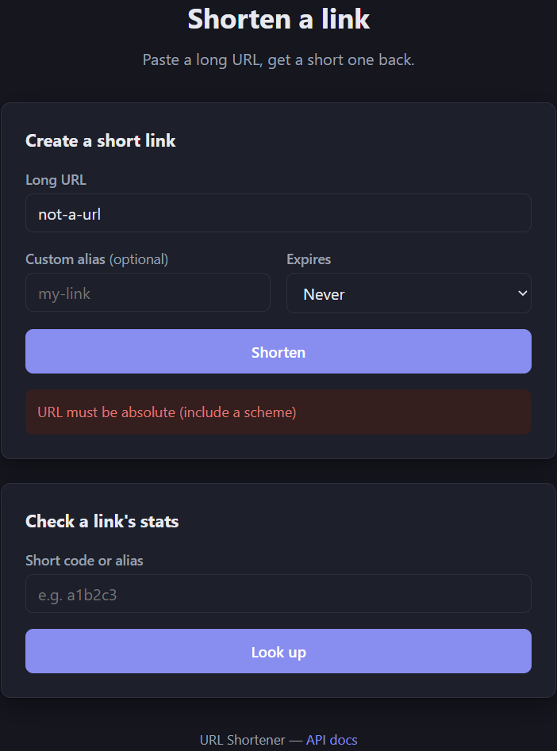
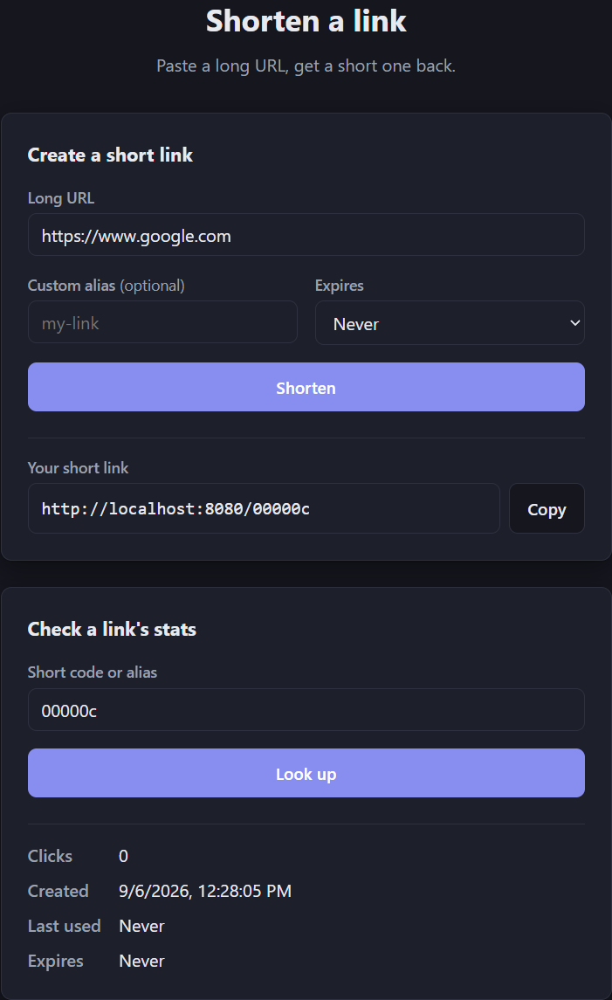

# Scenario: Greenfield — Web UI

**Type**: Greenfield (a wholly new capability, not an extension of already-shipped behavior).

## Requirement

Everything up to this point in the project is an API consumed by `curl` or a client library —
there is no page anyone can open in a browser. The ask: a simple, sleek (not amateurish) web page
that lets a visitor shorten a URL (with an optional custom alias and expiration) and look up an
existing code's stats, using the API that already exists, with no new backend capability and no
accounts, history, or dashboard.

## Why this counts as greenfield

Nothing comparable exists in this codebase to extend. There is no `static/` resources directory,
no served HTML, and static resource serving was in fact explicitly *disabled*
(`spring.web.resources.add-mappings: false` in `application.yml`) since this has been an API-only
service from its first commit. This introduces a new kind of artifact into the project — a page a
person interacts with directly — rather than adding a field, a column, or an endpoint to
something that already ships. That distinguishes it from brownfield work (which extends
already-tested behavior, as in `brownfield-click-analytics.md`) even though, mechanically, it
still touches a handful of existing files (one line of configuration, three documentation files)
to get there.

## Decomposition

Tasks, in dependency order (see `specs/002-web-ui/tasks.md` for the full breakdown):

1. Remove the static-resource-serving override and confirm nothing else depends on it being off —
   the redirect route's own safety property (short codes and aliases can never contain a `.`,
   which every static filename does) meant no change to `RedirectController` or the reserved-name
   list was needed to make this safe.
2. Build the page shell and a shared visual foundation (typography, color palette, spacing,
   responsive rules) once, since a consistent look benefits from being designed holistically
   rather than assembled section by section.
3. Shorten-a-link: form markup, a `POST /api/links` submit handler, a copy-to-clipboard control
   with a fallback for browsers/contexts where the Clipboard API isn't available.
4. Explain failures: a client-side table mapping each `error` code the API already returns
   (`VALIDATION_ERROR`, `ALIAS_TAKEN`, `URL_ALREADY_SHORTENED`, `RATE_LIMITED`) to one plain
   sentence, shown inline rather than as a generic banner.
5. Stats lookup: a second form calling `GET /api/links/{code}/stats`, rendering the same
   "not found" message for both a nonexistent and an expired code, matching the API's own
   indistinguishability guarantee.
6. Polish and documentation: a favicon, final visual details, and updates to
   `architecture-overview.md`, `getting-started.md`, and `design-decisions.md` — the last of
   which had a since-corrected claim that this project was "an API-only backend with no
   frontend."

## Execution

Built on `feature/web-ui`, deliberately branched from `main` rather than from the also-in-flight
`feature/custom-alias` branch, to keep the two features independently reviewable — a consequence
of that choice shows up under Risks/limitations below. Every file is hand-written HTML/CSS/vanilla
JavaScript with no framework and no build step, calling the existing JSON API via `fetch()`; the
only backend change is the one configuration line, matching this project's standing preference
for the smallest dependency footprint that solves the actual problem (the same reasoning that
chose an in-process cache over Redis and a hand-rolled rate limiter over a library elsewhere in
this codebase).

Testing this feature surfaced a Testcontainers/Docker compatibility gap already fixed on
`feature/custom-alias` (Docker Desktop rejecting `docker-java`'s outdated API version request) but
not yet present on `main` — resolved here by cherry-picking the single commit that switches
integration tests to Zonky's embedded-postgres (a real Postgres binary run directly on the host,
no Docker required) rather than re-deriving the same fix twice.

Two implementation bugs were found by actually running the suite and tracing the CSS logic, not
by inspection alone:

- `WebUiContractTest`'s first draft asserted directly on `GET /`'s rendered content. MockMvc
  records Spring Boot's welcome-page handling as a `forward:index.html` `ModelAndView` without
  re-dispatching that forward through the real resource handler — a documented MockMvc
  limitation. Confirmed the real application serves `/` correctly by running it directly and
  curling it; fixed the test by asserting only `200` on `/` and moving content assertions to
  `GET /index.html`, which MockMvc does execute fully.
- The short-link result field (`#short-url-output`) inherited `width: 100%` from the page's
  generic `input` styling, but as a flex item next to the copy button without `min-width: 0`, it
  would not have shrunk below its content size on a narrow screen — a classic flexbox overflow,
  directly against this feature's own no-horizontal-scrolling requirement. Caught by tracing the
  layout rules during manual verification, fixed with `flex: 1; min-width: 0;`.

## Validation

- `mvn test` — 82 tests, 0 failures. The same 12 errors already identified and left unfixed on
  `feature/custom-alias` (a pre-existing `@Transactional` gap in `ShortLinkService.create(String)`
  inherited from `main`, unrelated to this feature) reproduce identically here, confirming the
  same root cause and the same unaffected scope.
- No browser-automation tooling (no `chromium-cli`, no Node/Playwright) was available in the
  environment this feature was built in, so the quickstart scenarios were first run as direct HTTP
  calls matching exactly what `app.js` sends and parses, against a real running instance, with the
  rendering logic traced by hand against those real responses. The screenshots below, taken
  separately in an actual browser, close most of that gap — see Risks/limitations for what's
  still unconfirmed.
- Confirmed directly: shortening a URL and receiving a real short link back; a malformed URL
  rejected with its specific validation message; a stats lookup reflecting an actual redirect
  (`clickCount` moving from `0` to `1`, `lastAccessedAt` populating); a nonexistent code returning
  the plain "not found" response the page shows without alteration.

The page as it actually renders, in a real browser (dark mode, per the visitor's system
preference):

**Initial state** — both cards visible, no accounts or history in sight:

**A successful shorten** — the result appears in place, with a working copy control:

**A rejected submission** — plain-language, not a raw error payload:

**A stats lookup** — click count, creation time, last-used time, and expiration, all from the
existing API with nothing added:

## Risks / limitations

- The custom-alias field on the shortening form is currently a no-op on this branch: `main` (and
  therefore `feature/web-ui`) doesn't include the custom-alias feature, and Spring Boot's default
  Jackson configuration silently ignores unknown JSON properties rather than rejecting them, so a
  submitted alias is accepted and quietly discarded. The UI code already sends the right field and
  handles the right conflict responses (`ALIAS_TAKEN`, `URL_ALREADY_SHORTENED`) for when the two
  branches are combined — this is a branch-topology consequence of building the features
  separately, not a defect to fix in this feature's own code, but it means the alias flow has not
  actually been exercised against a live conflict yet.
- No automated coverage exists for interactive JavaScript behavior (form submission, the copy
  action, error rendering) — a deliberate scope decision (see `specs/002-web-ui/plan.md`), not an
  oversight, since introducing a JS test runner would be the first build-tooling dependency
  anywhere in this project. The screenshots above confirm the visual side of form submission,
  error rendering, and the stats lookup in an actual browser; the copy-to-clipboard action itself
  (and its fallback for browsers/contexts where the Clipboard API is unavailable) and the
  responsive layout at a phone-sized viewport were not captured and remain unverified visually —
  worth a quick check before this is considered fully validated.
